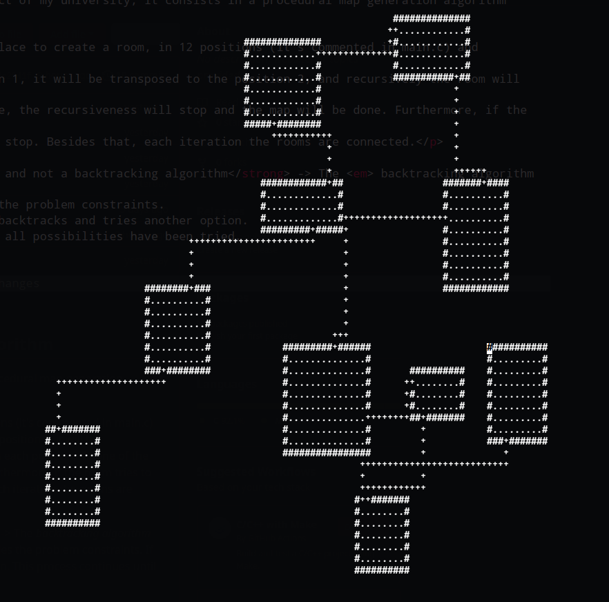

<h2>Procedural Generation - Backtracking inspired algorithm</h2>

<samp>
I developed this algorithm for the LA project of my university, it consists in a procedural map generation algorithm built from scratch.
</samp>

Basically, this algorithm consists in finding a place to create a room, in 12 positions (it's commented in main.c) and recursively create more rooms.
For example, if the room can't be created in position 1, it will be transposed to the position 2, and recursively the room will try to be generated in
each position, if none of the positions are available, the recursiveness will stop and the map will be done. Furthermore, if the room tries to be
generated outside the main screen, the program won't stop. Besides that, each iteration the rooms are connected.

<strong>This is a backtracking inspired algorithm and not a backtracking algorithm</strong> -> The <em> backtracking algorithm </em> works by trying out each possible 
 solution in turn and checking whether it satisfies the problem constraints. 
 If a solution violates a constraint, the algorithm backtracks and tries another option.
 This process continues until a solution is found or all possibilities have been tried.

<h3 align="center"><samp><strong>Example of a small map</strong></samp></h3>

   Picture taken at 23/04/2023

<h2>How to install</h2>

Just clone the repo inside any directory in your pc

<pre>$ git clone https://github.com/pedroacamargo/backtracking-study</pre>

Type these commands in the given order for the algorithm work as expected

<pre>$ make clean</pre>
<pre>$ make</pre>

Then you can type <strong><code>./play</code></strong> in the terminal and the ncurses window in terminal will open

To generate the map, just hold the key <em><strong>p</strong></em>

<h3>Developed by:</h3>
<table>
<tr>
 <th><strong><a href="https://github.com/pedroacamargo">Pedro Augusto Camargo</a></strong></th>
</tr>
<tr>
 <td align="center"></td>
</tr>
</table>
